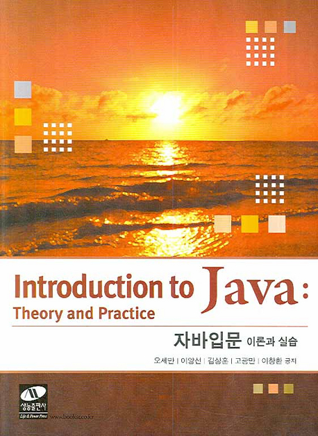

# Introduction to Java : Theory and Practice

**자바 입문 : 이론과 실습**

## List of Problems

### Chapter 2
어휘구조와 자료형

- [2.5](Problems/2.5.md)
- [2.6](Problems/2.6.md)
- [2.7](Problems/2.7.md)
- [2.8](Problems/2.8.md)
- [2.9](Problems/2.9.md)
- [2.10](Problems/2.10.md)

### Chapter 3
연산자

- [3.8](Problems/3.8.md)
- [3.9](Problems/3.9.md)
- [3.10](Problems/3.10.md)

### Chapter 4
문장

- [4.5](Problems/4.5.md)
- [4.6](Problems/4.6.md)
- [4.7](Problems/4.7.md)
- [4.8](Problems/4.8.md)

### Chapter 5
클래스

- [5.7](Problems/5.7.md)
- [5.8](Problems/5.8.md)
- [5.9](Problems/5.9.md)
- [5.10](Problems/5.10.md)

### Chapter 6
확장 클래스와 인터페이스

- [1](Problems/1.md)

### Chapter 7
패키지

- [1](Problems/1.md)

### Chapter 8
그래픽 프로그래밍

- [1](Problems/1.md)

### Chapter 9
예외와 단정

- [1](Problems/1.md)

### Chapter 10
제네릭과 어노테이션

- [1](Problems/1.md)

### Chapter 11
스레드

- [1](Problems/1.md)

### Chapter 12
그래픽 사용자 인터페이스

- [1](Problems/1.md)

### Chapter 13
자바의 기본 패키지

- [1](Problems/1.md)