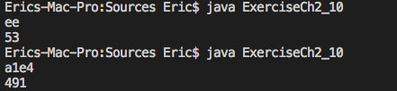

# 2.10 Solution

입력받은 16진수 숫자를 10진수 숫자로 바꿔주는 프로그램이다.

## Output

### [**Problem**](../Problems/2.10.md)

___

### [**Next Problem**](../Problems/3.8.md)

### [**Back to the List**](../#list-of-problems)