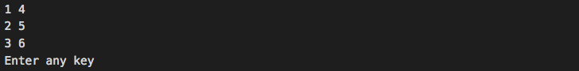

# 2.7 Solution

## Source Code

```java
public class ExerciseCh2_7 {
	public static void main(String[] args) throws java.io.IOException {
		int[][] a  =  { {1,2,3 },
						{4,5,6} };
		int[][] b = new int[3][2];
		transpose(a,b,2,3);
		// print out the transposed matrix
		for (int i=0; i<b.length; ++i) {
			for (int j=0; j<b[0].length; ++j)
				System.out.print(b[i][j]+" ");
			System.out.println();
		}
		System.out.println("Enter any key");	// for J++,
		System.in.read();						//    halt the output window
	}
	static void transpose(int[][] matrix, int[][] tmatrix, int n, int m) {
		for (int i=0; i<n; i++)
			for (int j=0; j<m; j++)
				tmatrix[j][i] = matrix[i][j];
	}
}
```

## Output



### [**Problem**](../Problems/2.7.md)

___

### [**Next Problem**](../Problems/2.8.md)

### [**Back to the List**](../#list-of-problems)