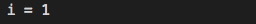
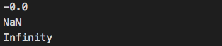

# 3.9 Solution

## Output

### (1)

### (2)

### (3)

### (4)

### [**Problem**](../Problems/3.9.md)

___

### [**Next Problem**](../Problems/3.10.md)

### [**Back to the List**](../#list-of-problems)