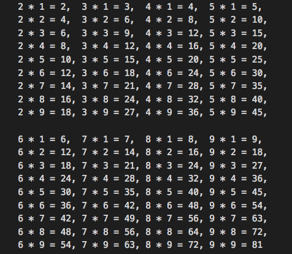

# 4.8 Solution

### (1)
```java
public class ExerciseCh4_8_1 {
    private static final int MAX = 100;
    private static Boolean isPrime(int n){
        for (int i = 2; i < n; i++) {
            if (n % i == 0)
                return false;
        }
        return true;
    }
    public static void main(String[] args) {
        int i;
		for (i=2; i<=MAX; i++)
            if (isPrime(i))
                System.out.print(i + " ");
        System.out.println();
    }
}
```


### (2)
```java
public class ExerciseCh4_8_2 {
	public static final int MAX = 500;
	public static void main(String[] args) {
		int i, j;
		int s;
		for (i=1; i<=MAX; i++) {
			s = 0;
			for (j=1; j<=i/2; j++)
				if (i%j == 0) s += j;
			if (i==s)
				System.out.println("*** perfect number : " + s);
		}
	}
}
```


### (3)
```java
class ExerciseCh4_8_3 {
	static int readInt() throws java.io.IOException 
	{
		char ch;
		int n = 0;
		
		// skip non-digit characters
		while (!Character.isDigit(ch = (char)System.in.read()));
		
		do 
		{
			n = n * 10 + (ch - '0');
			ch = (char)System.in.read();
		} while (Character.isDigit(ch));
		return n;
	}
	
	public static void main(String[] args) throws java.io.IOException {

        int o, r;  // o: origin, r: reverse
        int i, j;

        System.out.print(" Enter a number : ");
        o = readInt();

        i = o; r = 0;
        while (i != 0) {
            j = i % 10;
            r = r * 10 + j;
            i = i / 10;
        }
        if (r == o) System.out.println(" *** palindrome ***");
           else System.out.println("*** non-palindrome ***");
	}
}
```


### (4)
```java
public class ExerciseCh4_8_4 {
	public static void main(String[] args) {
		int i,j,k;
		int n1, n2;

		for (i=1; i<5; ++i)
			for (j=0; j<=9; ++j)
				for (k=0; k<=9; ++k) {
					n1 = i*100 + j*10 + k;            // number value
					n2 = i*i*i + j*j*j + k*k*k;       // triple power
					if (n1 == n2) System.out.println("Amstrong number = " + n1);
				}
	}	
}
```


### (5)
```java
public class ExerciseCh4_8_5 {
    // greatest common divisor
    private static int gcd(int n, int m) {
        int result = 1;
        for (int i = 1; i <= n && i <= m; i++) {
            if ((n % i == 0) && (m % i == 0))
                result = i;
        }
        return result;
    }

    // least common multiple
    private static int lcm(int n, int m) {
        int i = n >= m ? m : n;
        while (true){
            if (i % n == 0 && i % m == 0)
                return i;
            i++;
        }
    }

    public static void main(String[] args) {
        int n, m;
        System.out.print(" Enter a number 1 : ");
        n = Integer.parseInt(System.console().readLine());
        System.out.print(" Enter a number 2 : ");
        m = Integer.parseInt(System.console().readLine());

        System.out.println("GCD : " + gcd(n, m));
        System.out.println("LCM : " + lcm(n, m));
    }
}
```


### (6)
```java

```


### (7)
```java

```


### (8)
```java
public class ExerciseCh4_8_8 {
	public static void main(String[] args) throws java.io.IOException {
		int i,j;

		for (j=1; j<10; j++) {
			for (i=2; i<=5; i++)
				System.out.print("\t" + i + " * " + j + " = " + i*j + ",");
			System.out.println();
		}
		System.out.println();
		for (j=1; j<10; j++) {
			for (i=6; i<=9; i++) {
				System.out.print("\t" + i + " * " + j + " = " + i*j);
				if (i != 9 || j != 9) System.out.print(",");
			}
			System.out.println();
		}
		System.in.read();
	}
}
```


### (9)
```java

```


### (10)
```java

```


### [**Problem**](../Problems/4.8.md)

___

### [**Next Problem**](../Problems/5.7.md)

### [**Back to the List**](../#list-of-problems)