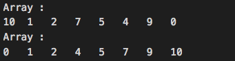

# 5.10 Solution

### (1)
```java
public class ExerciseCh5_10_1 {
    static void methodA(long l) {
        System.out.println("Argument type is long");
    }
    static void methodA(double d) {
        System.out.println("Argument type is double");
    }
    public static void main(String[] args) {
        methodA(1);
    }
}
```


### (2)
```java
class OuterClass {
    void print() {
        System.out.println("main() in Outer$Inner.class");
    }

    public static class ExerciseCh5_10_2 {
        public static void main(String[] args) {
            OuterClass p = new OuterClass();
            p.print();
        }
    }
}
```


### (3)
```java
class OuterClass {
	static class InnerClass {
		static String str;
		InnerClass(String s) {
			str = s;
		}
		static void print(String s) {
			str = s;
			System.out.println(s);
		}
		static void staticPrint() {
			print(str);
		}
	}
} // end of OuterClass
public class ExerciseCh5_10_3 {
	public static void main(String[] args) {
		String s = "ExerciseCh5_12";
		OuterClass.InnerClass p = new OuterClass.InnerClass(s);
		p.staticPrint();
		OuterClass.InnerClass.staticPrint();
	}
}
```


### (4)
```java
class Sort {
    void swap(int v[], int i, int j) {
        int temp;
        temp = v[i];
        v[i] = v[j];
        v[j] = temp;
    }
    public void Qsort(int a[], int left, int right) {
        int pe;
        int i, last;

        if (left >= right) return;
        pe = (left+right)/2;
        swap(a, left, pe);
        last = left;
        for (i=left+1; i<=right; i++)
            if (a[i] < a[left]) swap(a, ++last, i);
        swap(a, left, last);
        Qsort(a, left, last-1);
        Qsort(a, left+1, right);
    }
}

public class ExerciseCh5_10_4 {
    private static void printArray(int a[]) {
        System.out.println("Array : ");
        for (int n: a)
            System.out.print(n + "\t");
        System.out.println();
    }
    public static void main(String[] args) {
        int[] arr = { 10, 1, 2, 7, 5, 4, 9, 0 };
        Sort sort = new Sort();

        printArray(arr);
        sort.Qsort(arr, 0, arr.length-1);
        printArray(arr);
    }
}
```


### [**Problem**](../Problems/5.10.md)

___

### [**Next Problem**](../Problems/6.6.md)

### [**Back to the List**](../#list-of-problems)