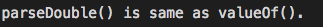

# 7.8 Solution

```java
public class ExerciseCh7_8 {
    public static void main(String[] args) {
        String s = "0.526";
        double d1 = Double.parseDouble(s);
        double d2 = Double.valueOf(s);

        if (d1 == d2) System.out.println("parseDouble() is same as valueOf().");
            else System.out.println("parseDouble() is not same as valueOf().");
    }
}
```



### [**Problem**](../Problems/7.8.md)

___

### [**Next Problem**](../Problems/7.9.md)

### [**Back to the List**](../#list-of-problems)